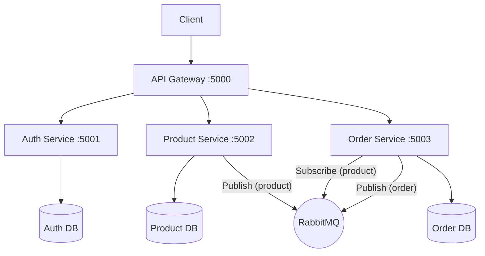

# E-Commerce Microservices Application

This project is a microservices-based e-commerce platform demonstrating a distributed architecture using Node.js, Express, PostgreSQL, RabbitMQ, and Docker.

## 🏗 Architecture

The application is composed of several independent services that communicate via REST APIs and an asynchronous message broker (RabbitMQ).



## 🚀 Technology Stack

- **Runtime**: Node.js
- **Framework**: Express.js
- **Databases**: PostgreSQL (Multi tenant definitions for each service)
- **Message Broker**: RabbitMQ (for asynchronous communication between services)
- **API Gateway**: Custom Node.js/Express Gateway
- **Containerization**: Docker & Docker Compose

## 📦 Services Overview

| Service | Port | Description | Dependencies |
|---------|------|-------------|--------------|
| **API Gateway** | `5000` | Single entry point for all client requests. Routes traffic to appropriate microservices. | Auth, Product, Order |
| **Auth Service** | `5001` | Handles user registration and authentication (JWT). | `auth-db` (PostgreSQL) |
| **Product Service** | `5002` | Manages product inventory and details. Publishes events to RabbitMQ. | `product-db` (PostgreSQL), RabbitMQ |
| **Order Service** | `5003` | Handles order creation and processing. Consumes product events. | `order-db` (PostgreSQL), RabbitMQ, Product Service (HTTP) |

## 🛠 Prerequisites

- [Docker](https://www.docker.com/products/docker-desktop)
- [Docker Compose](https://docs.docker.com/compose/install/)

## 🏁 Getting Started

1.  **Clone the repository**
    ```bash
    git clone <repository-url>
    cd ecommerce-app-source
    ```

2.  **Start the application**
    Build and start all services using Docker Compose:
    ```bash
    docker-compose up --build
    ```

    This command will:
    - Build the Docker images for `api-gateway`, `auth`, `product`, and `order` services.
    - Start the required infrastructure: PostgreSQL databases (for auth, product, order) and RabbitMQ.
    - Start the microservices.

3.  **Verify Running Services**
    Check the status of your containers:
    ```bash
    docker-compose ps
    ```

## 🧪 API Endpoints

The API Gateway is exposed on port **5000**. You can access the services through the following routes:

- **Auth**: `http://localhost:5000/auth/*` -> Forwards to Auth Service
- **Product**: `http://localhost:5000/products/*` -> Forwards to Product Service
  - Example: `GET http://localhost:5000/products/`
- **Order**: `http://localhost:5000/orders/*` -> Forwards to Order Service
  - Example: `POST http://localhost:5000/orders/`

## 🔧 Configuration

Configuration is managed via environment variables defined in the `docker-compose.yml` file.

Key variables include:
- `POSTGRES_USER` / `POSTGRES_PASSWORD`: Database credentials
- `RABBITMQ_URL`: Connection string for the message broker
- `*_URL`: Service discovery URLs (e.g., `AUTH_URL`, `PRODUCT_URL`)

## 🤝 Contribution

Contributions are welcome! Please fork the repository and submit a pull request for any enhancements or bug fixes.
